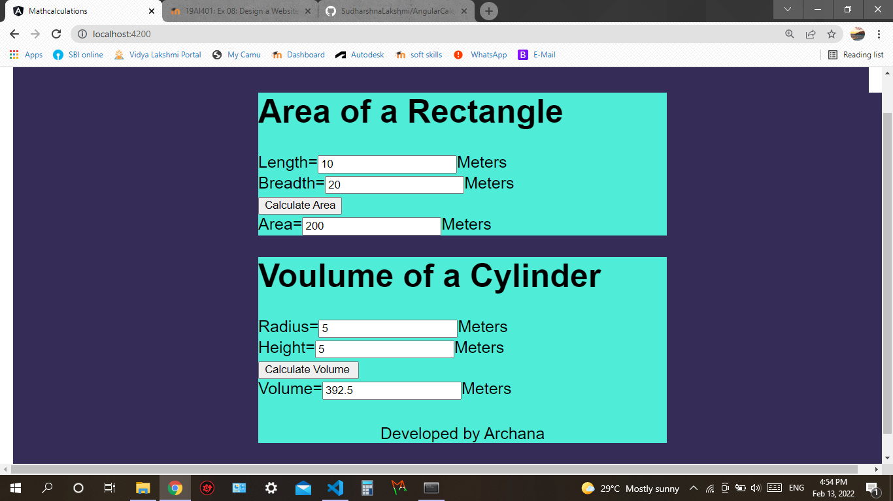

# AngularCalculation

# Web Page for Mathematical Calculations using Angular

## AIM:
To design a dynamic website to perform mathematical calculations using Angular Framwork

## DESIGN STEPS:

### Step 1:

Requirement collection.

### Step 2:

Creating the layout using HTML and CSS in component.html file

### Step 3:

Write typescript to perform the calculations.

### Step 4:

Validate the layout in various browsers.

### Step 5:

Validate the HTML code.

### Step 6:

Publish the website in the given URL.

## PROGRAM :
### app.component.html:
```
<body>
<h1>Math Calculations</h1>
<div class="container">
   <div class="content">
       <Rectangle-Area></Rectangle-Area>


    </div>
<div class="content">
    <Cylinder-volume></Cylinder-volume>
<div class="footer">Developed by Archana</div>

</div>
</div>
</body>
```
### app.component.css:
```
 {
    box-sizing:border-box;
    font-family: Arial, Helvetica, sans-serif;
  }
  body {
    background-color:rgb(53, 44, 87);
  }
  .container {
    width:1080px;
    margin-left: auto;
    margin-right: auto;
    padding-left: 300px;
    max-height:max-content;
    background-color:rgb(53, 44, 87);
    padding-bottom: 45px; ;
  }
  .content {
    display:block;
    width: 500px;
    background-color:rgb(79, 236, 215);
    min-height: 150px;
    font-size: 20px;
    position:relative;
    
  }
  h1{
    text-align: center;
    color:black;
  }
  
  .footer {
    display: inline-block;
    width: 100%;
    height: 40px;
    background-color:rgb(79, 236, 215);
    text-align:center;
    padding-top: 30px;
    margin: 0px 0px 0px 0px;
    color: #000000;
  }
  ```
  ### app.component.ts:
```
import { TestBed } from '@angular/core/testing';
import { AppComponent } from './app.component';

describe('AppComponent', () => {
  beforeEach(async () => {
    await TestBed.configureTestingModule({
      declarations: [
        AppComponent
      ],
    }).compileComponents();
  });

  it('should create the app', () => {
    const fixture = TestBed.createComponent(AppComponent);
    const app = fixture.componentInstance;
    expect(app).toBeTruthy();
  });

  it(`should have as title 'mathcalculations'`, () => {
    const fixture = TestBed.createComponent(AppComponent);
    const app = fixture.componentInstance;
    expect(app.title).toEqual('mathcalculations');
  });

  it('should render title', () => {
    const fixture = TestBed.createComponent(AppComponent);
    fixture.detectChanges();
    const compiled = fixture.nativeElement as HTMLElement;
    expect(compiled.querySelector('.content span')?.textContent).toContain('mathcalculations app is running!');
  });
});
```
### rectangle.component.html:
```
<div>
    <h1>Area of a Rectangle</h1>
    Length=<input type="text" [(ngModel)]="length">Meters<br/>
    Breadth=<input type="text" [(ngModel)]="breadth">Meters<br/>
        <input type="button"  (click)="onCalculate()" value="Calculate Area"><br/>
    Area=<input type="text"[value]="area">Meters<br/>

</div>
```
### rectangle.component.css:
```
{
    box-sizing:border-box;
    font-family: Arial, Helvetica, sans-serif;
  }
  body {
    background-color:rgb(53, 44, 87);
  }
  .container {
    width:1080px;
    margin-left: auto;
    margin-right: auto;
    padding-left: 300px;
    max-height:max-content;
    background-color:rgb(53, 44, 87);
    padding-bottom: 45px; ;
  }
  .content {
    display:block;
    width: 500px;
    background-color:rgb(79, 236, 215);
    min-height: 150px;
    font-size: 20px;
    position:relative;
    
  }
  h1{
    text-align: center;
    color:black;
  }
  
  .footer {
    display: inline-block;
    width: 100%;
    height: 40px;
    background-color:rgb(79, 236, 215);
    text-align:center;
    padding-top: 30px;
    margin: 0px 0px 0px 0px;
    color: #000000;
  }
  ```
  ### rectangle.component.ts:
```
@Component({
    selector:"Rectangle-Area",
    templateUrl:"./rectangle.component.html"

})

export class RectangleComponent{
    length:number;
    breadth:number;
    area:number;
    constructor(){
        this.length=10;
        this.breadth=20;
        this.area=this.length*this.breadth;
    }

    onCalculate()
    {
        this.area= this.length*this.breadth;
    }

}
```
### cylinder.component.html:
```
<div>
    <h1>Voulume of a Cylinder</h1>
    Radius=<input type="text" [(ngModel)]="radius">Meters<br/>
    Height=<input type="text"  [(ngModel)]="height">Meters<br/>
    <input type="button"  (click)="onCalculate()" value="Calculate Volume "><br/>       
    Volume=<input type="text"[value]="volume">Meters<br/>

</div>
```
### cylinder.component.css:
```
    {
    box-sizing:border-box;
    font-family: Arial, Helvetica, sans-serif;
  }
  body {
    background-color:rgb(53, 44, 87);
  }
  .container {
    width:1080px;
    margin-left: auto;
    margin-right: auto;
    padding-left: 300px;
    max-height:max-content;
    background-color:rgb(53, 44, 87);
    padding-bottom: 45px; ;
  }
  .content {
    display:block;
    width: 500px;
    background-color:rgb(79,236,215);
    min-height: 150px;
    font-size: 20px;
    position:relative;
    
  }
  h1{
    text-align: center;
    color:black;
  }
  
  .footer {
    display: inline-block;
    width: 100%;
    height: 40px;
    background-color:rgb(79, 236, 215);
    text-align: center;
    padding-top: 30px;
    margin: 0px 0px 0px 0px;
    color: #000000;
  }
  ```
### cylinder.component.ts:
```
import{ Component } from "@angular/core";
@Component({
    selector:"Cylinder-volume",
    templateUrl:"./cylinder.component.html"

})

export class CylinderComponent{
    radius:number;
    height:number;
    volume:number;
    pi:number;
    constructor(){
        this.radius=5
        this.height=5
        this.pi=3.14
        this.volume=this.radius*this.radius*this.height*this.pi;
    }
    onCalculate()
    {
        this.volume=this.radius*this.radius*this.height*this.pi;  
    }
}
```

## OUTPUT:


## Result:
A dynamic website to perform mathematical calculations using Angular Framwork has been successfully designed.

